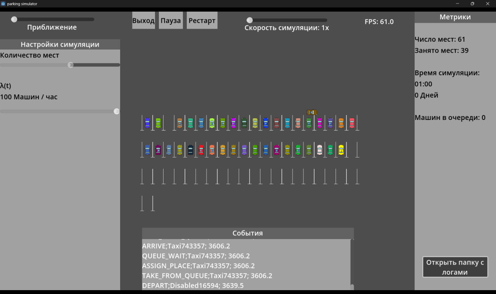

# 📘 **README.md — Parking Simulator**



# 🚗 Parking Simulator

**Parking Simulator** — это учебный проект, реализующий дискретно-событийную модель работы парковки. Пользователь задаёт количество парковочных мест, интенсивность потока машин (λ), стратегию очереди и скорость симуляции. Программа визуализирует движение автомобилей, занятость парковки, очередь и генерирует журнал событий.

Проект создан в рамках дисциплины **«Технологии программирования»**.

---

## ✨ **Основные возможности**

* 📦 **Генерация автомобилей** с заданной интенсивностью (λ машин/час).
* 🅿️ **Моделирование поиска места:**

  * машины становятся в очередь,
  * назначаются на свободное место,
  * выполняют заезд, стоянку, выезд.
* 👀 **Визуализация парковки** — движение машин по маршрутам.
* 📝 **Журнал событий (Event log)**:
  ARRIVE, QUEUE_WAIT, ASSIGN_PLACE, TAKE_FROM_QUEUE, DEPART
* 📊 **Метрики в реальном времени:**

  * число мест,
  * занятость,
  * время симуляции,
  * длина очереди.
* 📁 **Автоматический экспорт событий в лог-файлы**
  (формат `parking_log_YYYY-MM-DD_HH-MM-SS.csv`).
* 🔎 **Открытие папки с логами одной кнопкой**.

---

## 🧠 **Как работает симуляция**

1. Пользователь нажимает **Старт**.
2. Каждый интервал времени, заданный λ, создаётся новая машина.
3. Машина помещается в очередь.
4. При появлении свободного места:

   * выбирается машина с наивысшим приоритетом,
   * назначается парковочное место,
   * машина визуально заезжает и стоит указанное время.
5. После выезда освобождённое место передаётся следующей машине из очереди.
6. Все события фиксируются в журнале и UI.

---

## 🖥️ **Скрипты проекта**

| Файл                             | Описание                                                         |
| -------------------------------- | ---------------------------------------------------------------- |
| **`main.gd`**                    | Управление симуляцией: генерация машин, очередь, назначение мест |
| **`car.gd`**                     | Логика отдельной машины: заезд, стоянка, выезд                   |
| **`parking_lot.gd` / place.gd`** | Работа с парковочными местами                                    |
| **`ui.gd`**                      | Слайдеры, кнопки, вывод журнала, метрик                          |
| **`Journal.gd`**                 | Логирование событий, запись в файл с буферизацией                |

---

## 🔧 **Как пользоваться**

### **Запуск**

Открыть проект в Godot 4 → Запустить сцену `main.tscn`.

### **Основные элементы интерфейса**

* **Количество мест** — задаёт размер парковки.
* **λ(t)** — интенсивность потока автомобилей (машин в час).
* **Скорость симуляции** — ускоряет или замедляет течение времени.
* **Пауза / Рестарт** — управление симуляцией.
* **Открыть папку с логами** — открывает лог-файлы симуляции.
* **События** — отображает последние строки журнала в реальном времени.
* **Метрики** — число мест, занятость, время симуляции, длина очереди.

---

## 📝 **Формат лог-файлов**

Логи автоматически сохраняются в:

```
user://parking_log_YYYY-MM-DD_HH-MM-SS.csv
```

Пример строки:

```
ASSIGN_PLACE;Car128382; 3606.2
TAKE_FROM_QUEUE;Taxi743357; 3606.2
DEPART;Disabled16594; 3639.5
```

Открыть папку с логами можно из UI.

---

## 🧭 **Требования**

* **Godot Engine 4.x**
* ОС: Windows / macOS / Linux

---

## 🔮 **Планируемые улучшения**

* Полная реализация распределений времени стоянки (E1, E2, E3).
* Добавление стратегий очереди (D1/D2/D3) в интерфейс.
* Более точная реализация λ(t) по кусочным интервалам суток.
* Экспорт итоговых метрик в JSON/CSV.
* Модуль сравнения нескольких сценариев.

---

## 👤 Автор

Данило Драгович
Проект для курса **«Технологии программирования»**, НИТУ МИСИС.